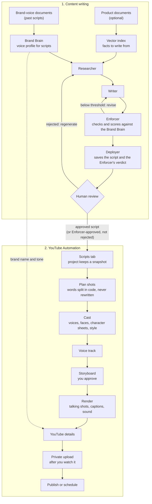

# BrandMaestro AI

Writes blog posts, ad copy, proposals, scripts and press releases in your brand's own voice — on whichever LLM you choose. Optionally turns approved scripts into story videos and publishes them to your YouTube channel.

---

## The problem

- A brand's voice lives in style guides and in people's heads.
- Generic AI drafts sound like generic AI, so writers redraft them by hand.
- The voice drifts between writers, channels and content types.

## What this does

- You upload approved past writing: blog posts, ads, proposals, scripts, press releases.
- The system reads it and builds a profile of how the brand writes. This is called the Brand Brain.
- You can also upload product documents (briefs, fact sheets) for the facts to write from.
- You ask for a new piece.
- Four agents research it, draft it, score it against the Brand Brain, and revise it until it passes.
- You get a draft that already sounds like the brand.

One Brand Brain per business and content type, so a brand's ads can sound different from its proposals.

---

## Two systems, one pipeline

BrandMaestro is two systems that work alone or together:

- **Content writing** turns a brand's documents into on-brand copy. It needs nothing from the video side.
- **YouTube Automation** turns an approved script into a published story video. It writes no scripts of its own: it takes approved scripts and ads from content writing, or a script you paste in yourself, labelled as imported.

Used together, one pipeline runs from brand voice to a published YouTube video:



### What happens at each stage

**1. Teach it the brand's voice** (content writing)
- **Brand-voice documents.** Upload approved past scripts in **Brand Documents**, as *Brand voice* for the content type *Script*. They are analysed into the **Brand Brain for scripts**: how the brand opens, its sentence rhythm, the phrases it uses and avoids, and rates measured from the writing itself.
- **Product documents.** Briefs and fact sheets are indexed separately, so facts come from them without diluting the voice.
- Each content type has its own Brand Brain, so a brand's video scripts can sound different from its press releases.

**2. Write the script** (content writing)
- In **Content Generator**, choose **Script** and give a topic.
- **Researcher** gathers facts from the product documents and, optionally, the web.
- **Writer** drafts against the Brand Brain.
- **Enforcer** runs rule checks: no invented quotes or contact details, no unfilled placeholders, no punctuation the brand never uses. It then scores style, tone, structure and signature phrases, and sends a weak draft back for revision.
- **Deployer** saves the result with the Enforcer's verdict.
- Name the speakers in the brief (for example "a two-person dialogue between a customer and a founder"). Lines written as `NAME: text` become characters on screen; everything else becomes narration.

**3. Approve it** (content writing, then the handoff)
- A person approves or rejects the script. A rejection can regenerate it, and the feedback teaches future drafts.
- Approving a **Script** or an **Ad** shows a **Make a video** button: pick Short or Long-form and it creates the YouTube Studio project and plans its shots. Ads are read as narration (Headline, Body and CTA labels are not spoken as names).
- **YouTube Studio → Scripts** lists every script a person approved, and every script the Enforcer approved and no person rejected. Each is labelled with which kind it is.
- Creating a project takes a **snapshot**: later edits or deletions in content writing never change a video in progress, and deleting a video project never touches the script.

**4. Make the video** (YouTube Automation)
- The script is split into shots **in code**, and a word check proves the spoken text matches the approved script exactly. A model only suggests what each shot shows.
- Each speaker is cast as a character with a voice. On-screen characters get face photos and an approved character sheet, so they look the same in every shot.
- The lines are voiced, the storyboard is drawn for you to approve, and the video is rendered: speaking shots lip-synced, narration over the still images, captions burned in.
- Details in [YouTube Automation](#youtube-automation).

**Checks against AI slop.** Listings are checked for hype, promises, numbers and contact details that are not in the script, and the brand's banned punctuation; a flagged draft is rewritten once. Storyboard images are checked and redrawn once when they contain text, panels, blurred strips or repeated people. Uploads record how much of the video you actually played. None of it blocks you; it reports (`youtube/quality.py`).

**5. Publish it** (YouTube Automation, drawing on the Brand Brain again)
- The title, description and tags are drafted from the script **and the same Brand Brain**, so the listing sounds like the brand too.
- You edit them, confirm you watched the video, and it is uploaded to your channel as private. You then publish it or schedule it.

### Using them separately

| You want | Use | Set up |
|---|---|---|
| On-brand blogs, ads, proposals, scripts, press releases | Content writing only | The core app. YouTube Automation can stay unconfigured; its workers never start. |
| Story videos on YouTube from brand scripts | Both | Content writing, plus the YouTube workers and settings ([Setting it up](#setting-it-up)) |
| Scripts for a video team that films them | Content writing only | Generate and approve **Script** content, then copy it from the generator |
| Videos from scripts you wrote elsewhere | YouTube Automation only | Paste or upload them in **Scripts → Import your own script**; the brand voice and checks are not applied to them |

Information flows one way. YouTube Automation reads approved scripts and the Brand Brain, and never writes to content writing's data.

---

## Content types

| Key | What it writes | Chunking |
|---|---|---|
| `blog` | Long-form blog articles | Paragraph-aware, large chunks |
| `ad` | Ad copy: headline, body, call to action | Sentence-level, short chunks |
| `proposal` | Business proposals | Section-aware, large overlapping chunks |
| `script` | Video, audio and presentation scripts | Scene- and line-aware |
| `press_release` | Press releases | Section-aware |

The list lives in `schema.CONTENT_TYPES`; chunking in `chunking_stategy.CHUNKING_REGISTRY`.

---

## The four agents

**1. Researcher** — pulls relevant passages from the brand's uploaded product documents (vector search), strips internal planning notes out of them, and, when web research is on, adds current context from the Parallel Search API.

**2. Writer** — plans, drafts and edits the piece against the Brand Brain, the research, and past reviewer feedback. On a revision pass it also gets the Enforcer's notes.

**3. Enforcer** — runs deterministic checks first (punctuation the brand never uses, measured writing rates, unfilled placeholders, invented quotes and contact details, copied source passages), then scores style, tone, structure and signature phrases with the model. Below threshold, it sends the draft back with notes. Content with invented claims is never approved.

**4. Deployer** — saves the approved content, sends a webhook if configured, and feeds high-scoring output back into memory.

The Writer and Enforcer loop up to `MAX_REVISION_ITERATIONS` times.

---

## Model providers

`model.py` uses a plug-and-adapter design. `LLMProvider` is an abstract adapter; each provider is one subclass that builds its LangChain chat model. `LLMSingleton` is the switch: it reads `LLM_PROVIDER`, plugs in the matching adapter, and hands out one chat model per task mode. Nodes only ever call `LLMSingleton.get(mode).invoke(prompt)`.

| `LLM_PROVIDER` | Adapter | Chat model | Credential | Default model |
|---|---|---|---|---|
| `vertex_ai` (default) | `VertexAIProvider` | `ChatVertexAI` | `PROJECT_ID` + ADC | `gemini-2.5-flash` |
| `groq` | `GroqProvider` | `ChatGroq` | `GROQ_API_KEY` | `llama-3.3-70b-versatile` |
| `claude` | `ClaudeProvider` | `ChatAnthropic` | `ANTHROPIC_API_KEY` | `claude-opus-5` |

```bash
LLM_PROVIDER=claude
LLM_MODEL=claude-sonnet-5      # optional; the adapter's default otherwise
```

Each task mode (`extraction`, `enforcement`, `synthesis`, `generation`) gets its own temperature, output cap and timeout from `LLMSingleton`; `LLM_TEMPERATURE_<MODE>` and `LLM_MAX_TOKENS_<MODE>` override them. Claude models that reject `temperature` (Opus 4.7+, Sonnet 5) are detected by `ClaudeProvider` and it is not sent. The API refuses to start if the selected adapter's credential is missing.

**Adding a provider:** subclass `LLMProvider`, set `name`, `default_model` and `required_env`, implement `to_langchain()`, and register the class in `LLMSingleton.PROVIDERS`.

```python
class MyProvider(LLMProvider):
    name = "my_provider"
    default_model = "my-model"
    required_env = ("MY_API_KEY",)

    def to_langchain(self, callbacks=None):
        from langchain_myprovider import ChatMyProvider
        return ChatMyProvider(model=self.model, temperature=self.temperature,
                              max_tokens=self.max_tokens, callbacks=callbacks or [])
```

### Embeddings

Retrieval over product documents uses the same design in `embedding_stategy.py`: an abstract `EmbeddingProvider`, three adapters, and `EmbeddingSingleton` as the switch. Groq and Anthropic have no embedding models of their own, so each LLM provider is paired with a backend:

| `LLM_PROVIDER` | Embeddings adapter | Model | Dimensions | Credential |
|---|---|---|---|---|
| `vertex_ai` | `VertexEmbedding` | `text-embedding-004` | 768 | `PROJECT_ID` + ADC |
| `claude` | `VoyageEmbedding` (Anthropic's recommended partner) | `voyage-4` | 1024 | `VOYAGE_API_KEY` |
| `groq` | `LocalEmbedding` (FastEmbed, in-process) | `BAAI/bge-small-en-v1.5` | 384 | none |

`EMBEDDING_PROVIDER=vertex_ai|voyage|local` overrides the pairing, e.g. Claude for writing with Vertex for retrieval. `EMBEDDING_MODEL` picks another model the adapter knows; `EMBEDDING_DIMENSIONS` sets Voyage's vector size (256, 512 or 1024). The local model downloads on first use into a Docker volume, so it survives redeploys.

The vector table name includes the dimension, so switching backend starts a fresh index — re-upload product documents afterwards.

---

## YouTube Automation

An optional module that turns approved scripts and ads (or a script you import) into short stories and ads on YouTube, with a recurring cast of AI characters, real product shots, sound and an end card. It lives in `youtube/`, has its own `yt_` tables, routes (`/youtube/...`), queues and workers, and marketing never imports it: the app runs the same whether or not it is set up. Full design, decisions and phase notes: [docs/youtube-automation.md](docs/youtube-automation.md).

### From script to YouTube

| Step | What happens | Who decides |
|---|---|---|
| 1. Pick a script | Human-approved scripts, enforcer-approved ones no person rejected, or **your own script**, pasted or uploaded (.txt / .md) in **Scripts → Import your own script** and labelled *Imported*. The project keeps a snapshot. | You |
| 2. Plan | The script is split into shots **in code**, so approved words never pass through a model; a word check proves nothing changed. A model only adds shot types and visuals. | — |
| 3. Cast and products | Characters with a voice each. Product photos and logos are uploaded once per business (**Styles → Products & logos**); a project lists the products it features, and a shot shows a product when its line or visual names it, or when you tick it for that shot. On-screen characters get face photos (only after confirming the right to use them) and an approved character sheet. A style lock gives every scene one look. | You |
| 4. Voice | Each line in its character's voice, joined into one track. | — |
| 5. Storyboard | One image per shot, drawn from the approved sheets so faces stay consistent, with product photos copied in where a product appears. Each image is checked automatically (borders in code; text, panels, blurred strips and repeated people by Gemini) and redrawn once if flagged; anything left is marked. Each shot also carries a sound line for its ambience. Redraw any shot. | You approve |
| 6. Render | Talking clips are upscaled, sharpened and colour-matched to their still so cuts do not jump. Music (an uploaded track) and per-shot ambience (generated from the shot's sound line with ElevenLabs, cached) play under the voice and duck while anyone speaks. An optional end card (logo, call to action, URL on a brand colour, drawn in code so the text is exact) closes the video. Speaking shots are lip-synced for up to 6 s each; narration plays over the still with a slow pan. Captions are burned in, loudness normalised, thumbnail made. A budget check runs before paying for animation. | You confirm if over budget |
| 7. YouTube details | Title, description and tags drafted from the script and Brand Brain, then checked for hype, promises, numbers and contact details not in the script, and the brand's banned punctuation. A flagged draft is rewritten once; remaining issues are shown, and edits are checked too. | You edit |
| 8. Upload | Only after you confirm you watched the video; the app records how much you played and asks again if it was under 80%. Uploaded **private**, resumable, marked as containing AI-generated content, waits for quota when the day's is used up. | You |
| 9. Publish | Make public now, or schedule. The result is read back from YouTube. | You |

### Providers (plug and adapter, like `model.py`)

| Port | Adapters | Selected by | Cost |
|---|---|---|---|
| `VoicePort` | `kokoro` (local, CPU), `google_tts` | `YT_VOICE_PROVIDER` | Kokoro free |
| `ImagePort` | `nano_banana` (Gemini 3.1 Flash Image on Vertex), `seedream` (fal.ai) | `YT_IMAGE_PROVIDER` | ~$0.067 / $0.03 per image |
| `AvatarPort` | `still` (no animation), `kling_standard` (fal.ai, `FAL_KEY`), `infinitetalk` (WaveSpeed, `WAVESPEED_API_KEY`) | `YT_AVATAR_PROVIDER` | $0 / ~$0.056 / $0.03–0.06 per animated second |
| `SoundPort` | `off`, `elevenlabs` (text to sound effects, `ELEVENLABS_API_KEY`) | `YT_SOUND_PROVIDER` | Per ElevenLabs plan |
| `StoragePort` | `gcs`, `local` | `YT_STORAGE_PROVIDER` (gcs when `YT_GCS_BUCKET` is set) | — |
| `PublisherPort` | YouTube Data API v3 | — | Free, quota-limited |

**Measured on production:** a 75-second vertical Short with two characters and 17 shots cost **$1.34** in Nano Banana images (including three redraws the image check asked for) and **$1.86** to animate its ten speaking lines with InfiniteTalk at 720p, so about **$3.50** in total. Planning took 26 s, voicing 111 s, drawing about 7 minutes, and assembly 6½ minutes; the animation itself was about 2½ minutes per line. Re-renders reuse the clips and cost nothing.

### Setting it up

1. **Workers.** Neither starts by default. `worker_youtube` plans, voices, draws and uploads; `worker_render` runs ffmpeg and animation, and is meant for a machine with spare CPU.
   ```bash
   docker compose --profile youtube up -d --build worker_youtube
   docker compose --profile render up -d --build worker_render
   ```
   Once they are running, deploys rebuild them with the API.
2. **Storage.** Set `YT_GCS_BUCKET` in production, or run the workers beside the API so they share the `yt_storage` volume.
3. **YouTube sign-in.** In Google Cloud: enable YouTube Data API v3, set the OAuth consent screen to *In production* (in *Testing*, sign-in expires after 7 days), and create a *Web application* OAuth client with the redirect URI `https://<your-domain>/youtube/channel/callback`. Then set:
   ```bash
   YT_GOOGLE_CLIENT_ID=...
   YT_GOOGLE_CLIENT_SECRET=...
   YT_OAUTH_REDIRECT_URI=https://<your-domain>/youtube/channel/callback
   ```
   Connect the channel from **YouTube Studio → Channel**.
4. **Talking characters (optional).** `YT_AVATAR_PROVIDER=kling_standard` with `FAL_KEY`, or `infinitetalk` with `WAVESPEED_API_KEY`. Only speaking shots are animated, for up to `YT_MAX_TALKING_SECONDS` each; clips are cached per provider, so switching provider re-animates and charges again.
5. **Sound (optional).** Music tracks are uploaded in the app and need no key. For generated per-shot ambience, set `YT_SOUND_PROVIDER=elevenlabs` with `ELEVENLABS_API_KEY`.
6. **Restart after changing `.env`.** Containers read it only when they start:
   ```bash
   docker compose --profile youtube --profile render up -d --force-recreate api worker_youtube worker_render
   ```

Every setting, with defaults, is in `.env.example` under *YouTube Automation*.

### Before publishing publicly

- **YouTube API audit.** Videos uploaded through the API from a Google Cloud project that has not passed [YouTube's API compliance audit](https://support.google.com/youtube/contact/yt_api_form) are locked private — even in YouTube Studio. Uploading and reviewing work before the audit; the app reports the lock if you try to publish.
- **Google data-access verification.** Until Google verifies the app's YouTube permissions, connecting shows an "unverified app" screen and at most 100 accounts can connect.
- **Custom thumbnails** need a phone-verified channel; otherwise the upload succeeds without one.
- **Public pages** required by Google are served by the app: `/about.html`, `/privacy.html`, `/terms.html`.

---

## Stack

| Layer | What |
|---|---|
| API | FastAPI, serving the UI from `static/` |
| Agents | LangGraph |
| Models | Vertex AI, Groq or Claude via provider adapters |
| Web search | Parallel Search API |
| Vector search | LlamaIndex + pgvector |
| Queue | Celery on Redis |
| Database | PostgreSQL 16 + pgvector |
| Cache | Redis: Brand Brain cache, LLM response cache, generation stream |
| Auth | JWT + Argon2 |
| Tracing | Opik (optional) |
| Video (optional) | Kokoro TTS, Gemini image models, Kling / InfiniteTalk, ffmpeg, YouTube Data API |

```
      FastAPI  ->  Redis (broker)  ->  workers (generation x2, feedback, retraining, rag)
         |                              |
         |                    Researcher -> Writer -> Enforcer -> Deployer
         |                              |
         +------ Redis (cache, stream) -+
                 PostgreSQL + pgvector

      optional:  yt_plan / yt_media / yt_publish -> worker_youtube
                 yt_render                       -> worker_render (ffmpeg)
```

---

## Running it

You need Docker, credentials for your chosen model provider (Vertex AI, Groq or Claude), and a Parallel API key.

```bash
cp .env.example .env     # set LLM_PROVIDER, its key, EMBEDDING_PROVIDER, PARALLEL_API_KEY, SECRET_KEY
docker compose up -d --build
```

Open http://localhost:8000.

| Service | Port |
|---|---|
| API + UI | 8000 |
| PostgreSQL | 5433 |
| Redis | 6379 |
| Flower | 5555 |

YouTube Automation needs its workers and settings first; see [Setting it up](#setting-it-up).

Pushes to `main` deploy to the production VM through `.github/workflows/deploy.yml`. `setup-vm.sh` prepares a fresh VM.

---

## API

All content endpoints need a bearer token. A user can only reach their own `business_id`.

| Method | Path | What |
|---|---|---|
| GET | `/health` | Health check |
| POST | `/users/create` | Register |
| POST | `/users/login` | Get a token |
| GET | `/users/me` | Current user |
| POST | `/conversation/generate/stream` | Generate, streamed |
| POST | `/conversation/feedback` | Submit review |
| GET | `/conversation/patterns/{business_id}/{content_type}` | Learned patterns |
| POST | `/documents/brand-voice` | Upload past published writing (builds the Brand Brain) |
| POST | `/documents/product` | Upload a product document (indexed for retrieval) |
| GET | `/documents` | List documents |
| GET | `/documents/brand-brain/{content_type}` | Read the Brand Brain |
| DELETE | `/documents/brand-brain/{content_type}` | Reset the Brand Brain |
| DELETE | `/documents/{document_id}` | Delete a document |
| | `/youtube/...` | YouTube Automation: scripts, characters, styles, projects, storyboard, render, channel, upload, publish ([full list](docs/youtube-automation.md#13-api-and-ui)) |

Example generation request:

```json
{
  "business_id": "…",
  "content_type": "proposal",
  "topic": "Managed analytics rollout for a 40-store retail chain",
  "format_type": "business proposal",
  "research_mode": "both"
}
```

`research_mode` is `both`, `rag` (product documents only) or `web` (Parallel only).

---

## Design decisions

**Four agents, not one prompt.** Each can be tuned and tested on its own, and the Enforcer can reject without re-running research. Costs latency; buys consistency.

**A synthesized Brand Brain, not raw chunks.** Raw examples contradict each other. The Brain is one distilled profile per business and content type, cached in Redis and Postgres. Invalidation is soft — a superseded profile keeps serving while its replacement is rebuilt — and synthesis is debounced, so ten uploads cost one rebuild.

**Two intake paths.** Past writing teaches voice and goes to the Brand Brain. Product documents supply facts and go to the vector index. Keeping them apart stops facts from diluting style.

**Deterministic gates before model scoring.** A scoring model can approve an empty-brain draft on one sample and reject it on the next. Rules that must hold — no invented quotes, no unfilled placeholders, no punctuation the brand never uses — are enforced in code.

**Providers as adapters.** Nodes never import a provider SDK; each provider is one `LLMProvider` subclass and `LLMSingleton` is the only switch. Responses are normalized to plain text in one place, so models that return content blocks (e.g. Claude with thinking) need no special handling downstream.

**Async generation.** Generation takes 30s+. The API returns an ID and streams progress over Redis. Separate queues per worker type stop generation starving feedback or RAG refresh.

**Caching.** The Brand Brain cache removes re-synthesis on every request — the largest saving. The Redis LLM response cache only helps byte-identical prompts. Prompts are ordered static-first, so providers with automatic prompt caching can discount the repeated prefix.

---

## Testing

```bash
uv sync --group dev
uv run pytest tests/
```

The suite needs no live services or API keys; YouTube, Google sign-in and the image and avatar providers are replaced with fakes. Render tests use ffmpeg from `imageio-ffmpeg` (a dev dependency) and are skipped if it is missing.

---

## Layout

```
main.py              FastAPI app and startup checks
model.py             LLM provider adapters and LLMSingleton switch
embedding_stategy.py Embedding adapters and EmbeddingSingleton switch
schema.py            Request models and content types
database.py          SQLAlchemy models
brand_rag.py         Vector search over product documents
brand_metrics.py     Brand Brain extraction and synthesis
chunking_stategy.py  Chunking per content type
celery_task.py       Task definitions and queues
learning_memory.py   Reviewer feedback storage and pattern analysis
human_loop.py        Regeneration after rejection
search.py            Parallel Search API
observability.py     Opik tracing
auth.py              JWT and access checks
graph/               LangGraph wiring, state, per-call deps
nodes/               researcher, writer, enforcer, deployer
prompts/             Prompt templates
routers/             API endpoints
utils/               Brand profile parsing and enforcement checks
static/              Web UI, plus the public About, Privacy and Terms pages
youtube/             YouTube Automation (optional; see docs/youtube-automation.md)
docs/                Design documents
tests/               Test suite
```

---

## License

MIT. See [LICENSE](./LICENSE).
